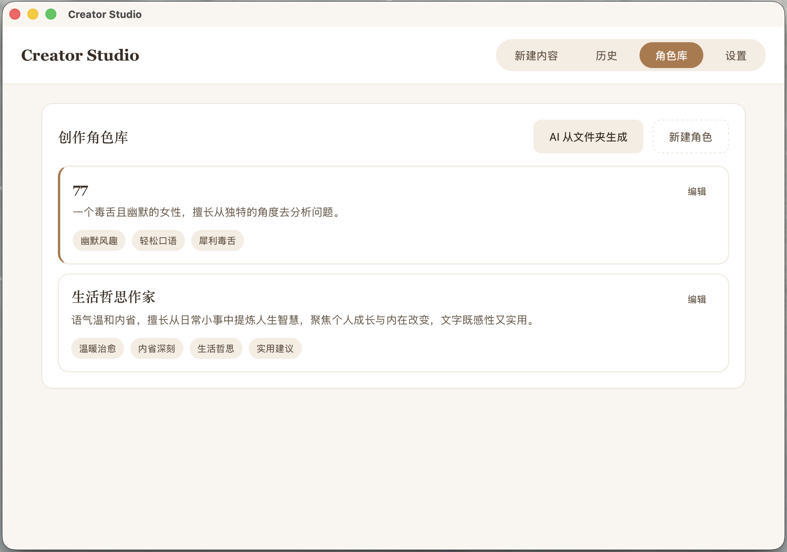
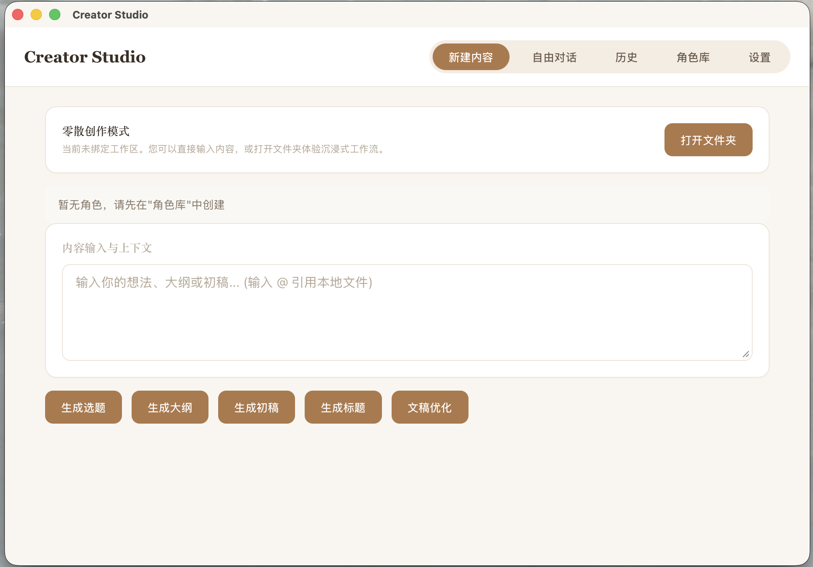

# Creator Studio

> 创作者桌面工具 — 使用 AI 帮助你生成选题、大纲、初稿和标题

<div align="center">


</div>

## ✨ 功能特性

### 🤖 AI 内容生成
- **选题卡片** - 从碎片想法中挖掘创作角度
- **故事大纲** - 生成完整的故事结构
- **初稿创作** - 快速产出内容初稿
- **标题生成** - 为内容起吸引人的标题
- **自由聊天** - 内置 /chatroom skill 与不同大佬进行头脑风暴




  
### 🔌 多 AI 提供商支持
- DeepSeek
- OpenRouter
- OpenAI (GPT-4o, GPT-4o-mini)
- Anthropic (Claude 3.5 Sonnet)
- 通义千问 (Qwen)
- Kimi (Moonshot)
- 智谱 GLM
- Gemini (Google)

### 👤 创作角色管理
- 创建不同风格的人设
- 为人设绑定不同的 AI 模型
- 从文件夹分析写作风格并创建人设

### 📚 历史管理
- 本地 SQLite 数据库存储
- 支持搜索和筛选
- 可删除单条或清空历史

### 💅 设计理念
- 温暖的棕色主题，护眼舒适
- 本地优先，数据完全掌控
- 简洁直观的操作界面

## 🛠️ 技术栈

| 层级 | 技术 |
|------|------|
| 前端框架 | React 19 + TypeScript |
| 状态管理 | Zustand |
| 样式方案 | CSS Variables + 组件化 |
| 桌面框架 | Tauri 2 |
| 后端语言 | Rust |
| 数据库 | SQLite (rusqlite) |
| 构建工具 | Vite 7 |

## 🚀 快速开始

### 环境要求
- Node.js 18+
- Rust 1.70+
- macOS / Windows / Linux

### 安装依赖
```bash
npm install
```

### 开发模式
```bash
npm run tauri dev
```

### 构建应用
```bash
npm run tauri build
```

## 📁 配置文件

所有配置存储在 `~/.creator/` 目录：

```
~/.creator/
├── providers.json    # AI 提供商配置
├── .env             # API 密钥
├── history.db       # SQLite 数据库
└── personas.json    # 创作人设（通过数据库管理）
```

## 💡 使用场景

### 内容创作
无论是短视频脚本、公众号文章、还是小说创作，Creator Studio 都能帮你：
1. 记录灵感碎片
2. AI 帮你梳理创作角度
3. 生成结构化大纲
4. 快速产出初稿
5. 优化标题

### 人设管理
针对不同的创作风格创建不同人设：
- 幽默风趣的段子手
- 深度分析的技术作者
- 温暖治愈的情感博主
- 专业严谨的知识科普

## 📦 项目结构

```
creator-studio/
├── src/                    # 前端源码
│   ├── components/         # React 组件
│   ├── hooks/             # 自定义 Hooks
│   ├── stores/            # Zustand 状态管理
│   ├── styles/            # 样式文件
│   └── types/            # TypeScript 类型
├── src-tauri/             # Tauri 后端
│   ├── src/
│   │   ├── commands/      # Tauri 命令
│   │   ├── db.rs          # 数据库操作
│   │   ├── models.rs      # 数据模型
│   │   └── lib.rs         # 入口文件
│   └── Cargo.toml         # Rust 依赖
└── package.json
```

## 📝 开发指南

### 添加新的 AI 提供商
在 `src-tauri/src/commands/settings.rs` 的 `ensure_providers_file()` 函数中添加新的提供商配置。

### 自定义主题
修改 `src/styles/variables.css` 中的 CSS 变量来定制颜色和样式。

## 📄 许可证

本项目采用 **非商业许可证** — 仅允许个人使用，禁止商业用途。

详见 [LICENSE](LICENSE) 文件。

## 🙏 致谢

- [Tauri](https://tauri.app/) - 跨平台桌面应用框架
- [React](https://react.dev/) - UI 框架
- [Zustand](https://zustand-demo.pmnd.rs/) - 状态管理

---

<div align="center">

**Made with ❤️ for creators**

</div>
